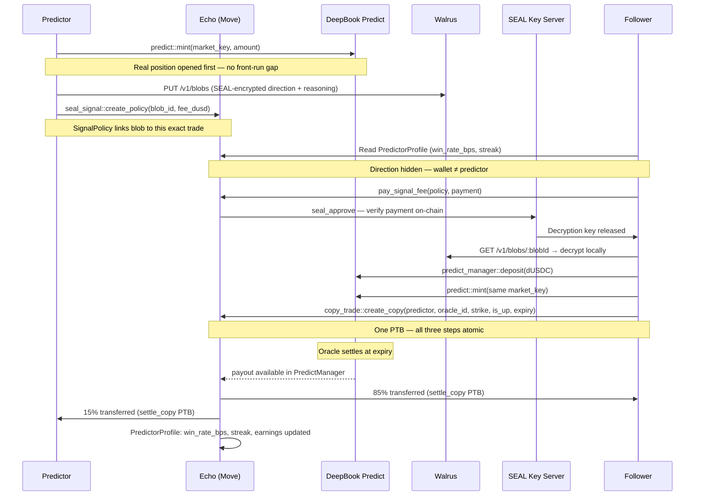

# Echo — Social Copy-Trading on DeepBook Predict

> **The first on-chain social copy-trading protocol where predictor payouts are enforced by Move smart contract, trade direction is encrypted by SEAL until copied, and reputation is computed entirely from settled on-chain outcomes — no middlemen, no trust, no fake signals.**

Built for **Sui Overflow 2026 · DeepBook Track**

---

## Why This Matters — Market Context

Copy trading is a $100B+ industry on centralized exchanges. Every major CEX — Binance, OKX, ByBit, eToro — runs a copy-trading product because the demand is provably there: new traders want to follow experts, and experts want to monetize their edge. But this entire market runs on platforms that hold custody, self-report win rates, and take 20–50% of predictor earnings. No equivalent exists on-chain.

| Metric | Value | Source |
|---|---|---|
| Global copy-trading volume (CEX) | $2.4B+ daily | Binance Copy Trading, 2024 |
| eToro registered users | 35M+ | eToro 2024 Annual Report |
| Binance Copy Trade monthly active followers | 5M+ | Binance Blog, Q3 2024 |
| Top crypto signal Telegram channels | 100K+ subscribers | Telegram tracker, 2024 |
| DeFi prediction market volume (2024) | $8.4B | Polymarket / Dune Analytics |
| On-chain copy-trading infrastructure | **$0 — does not exist** | — |
| Documented signal front-running losses | $1.2B+ (2024) | Chainalysis Crypto Crime Report |

The demand side is proven. The on-chain supply side doesn't exist. Echo is the first attempt to build it.

---

## Three Layers of the Problem

### 1. Predictor Payouts Depend on Trust

In early 2024, a BTC signals provider with 80,000 subscribers charged $199/month for directional calls. When an independent on-chain analyst traced the provider's disclosed wallet, it showed the wallet had opened positions an average of 4 minutes before each signal broadcast — front-running their own subscribers. The provider extracted an estimated $1.2M from the timing edge alone. Subscribers averaged a 34% win rate on signals they paid for. There was no contract, no refund mechanism, no recourse.

This is the structure of every centralized signal business: the provider controls the timing of broadcasts, controls win-rate reporting, and controls the payout flow. The follower is a counterparty with no leverage.

**Echo's fix:** The predictor posts the trade on-chain *first*. The `CopyRecord` is created atomically with the position mint — there is no gap to front-run. The predictor's 15% cut is encoded in `copy_trade::settle_copy` and cannot be changed, withheld, or rerouted. It is a PTB constraint, not a promise.

### 2. Win Rates Are Self-Reported

eToro's Popular Investor program displays win rates prominently — but those rates are computed by eToro, using eToro's definition, on eToro's servers. Independent research published in 2024 found that top-performing copy accounts showed 71% win rates on the leaderboard while their copy-followers experienced 54% median returns on the same signals — a 17-point gap explained by copy delay, slippage, and favorable backcalculation.

On Polymarket, there is no "trader profile" at all. Markets resolve, payouts go out, and there is no persistent identity that accumulates a verifiable track record over time.

**Echo's fix:** `PredictorProfile.win_rate_bps` is computed from settled `CopyRecord` objects on-chain — not from any off-chain database. Every update runs inside `settle_copy`, the same PTB that transfers the money. The stats displayed in Echo's feed are the stats written to the chain at settlement. There is nothing to game.

### 3. Signal Decryption Has No Accountability Layer

Premium signal providers sell access — Telegram groups at $99/month, newsletters at $299/year. The signal goes out. The trade wins or loses. The provider's wallet is not linked to the recommendation. There is no cryptographic proof the provider was even in the trade.

**Echo's fix:** SEAL encryption creates a verifiable link between the encrypted reasoning and the on-chain position. The `SignalPolicy` shared object stores the `blobId` of the encrypted signal blob and the unlock fee. `seal_approve` only releases the decryption key after verifying on-chain that the requester paid into the exact policy tied to the exact trade. If the predictor did not open the position on DeepBook first, the policy object does not exist — there is nothing to decrypt, and nothing to sell.

---

## The Solution — Echo

Echo is the social layer built on top of DeepBook Predict. It turns a solo binary options interface into a two-sided marketplace: predictors earn from followers automatically, followers copy verified traders in one transaction, and reputation accretes on-chain from real settled outcomes.

```
Predictor posts trade
    │
    ├──▶ predict::mint (real DeepBook position minted first)
    ├──▶ PredictorProfile created / updated (on-chain stats)
    └──▶ Optional: SEAL encrypts direction+reasoning → Walrus stores blob
                   seal_signal::create_policy(blob_id, fee_dusd)

Follower browses feed
    │
    ├──▶ Reads PredictorProfile: win_rate_bps, streak, best_streak, trades
    ├──▶ Direction hidden (wallet ≠ predictor address → Lock icon)
    └──▶ Optional: pay_signal_fee → SEAL key server verifies → decrypt locally

Follower copies (one PTB)
    │
    ├──▶ predict_manager::deposit (lock dUSDC)
    ├──▶ predict::mint (follower's position on DeepBook, same market_key)
    └──▶ copy_trade::create_copy (CopyRecord links follower → predictor on-chain)

Settlement (permissionless)
    │
    ├──▶ predict::redeem_permissionless (oracle settles)
    ├──▶ copy_trade::settle_copy (85% → follower · 15% → predictor · stats updated)
    └──▶ CopySettled event emitted · PredictorProfile.win_rate_bps recomputed
```

---

## What Makes Echo Different

| | Telegram Signal Groups | eToro / Binance Copy | Polymarket | **Echo** |
|---|---|---|---|---|
| On-chain execution | ❌ | ❌ | ✅ | ✅ |
| Verifiable win rate | ❌ | Platform-reported | ❌ | ✅ computed on-chain |
| Predictor earning mechanism | Trust / Venmo | 2% AUM fee (CEX) | N/A | ✅ 15% atomic in settle PTB |
| Payout custody | Provider's wallet | CEX holds | Smart contract | ✅ Zero — PTB atomic |
| Copy in one transaction | ❌ | ❌ | ❌ | ✅ |
| Signal encryption with proof-of-trade | ❌ | ❌ | ❌ | ✅ SEAL |
| Signal provider accountability | None | Rating system | N/A | ✅ on-chain position required |
| Decentralized reasoning storage | ❌ | ❌ | ❌ | ✅ Walrus |
| Front-running prevention | ❌ | ❌ | N/A | ✅ atomic PTB — position minted same tx |

The 15% predictor cut is not a configurable fee. It is a constant in `copy_trade.move`:

```move
const PREDICTOR_BPS: u64 = 1500; // 15% — immutable
```

`settle_copy` computes `assert!(payout_85 + payout_15 == total_payout)` and transfers both atomically. There is no admin key. There is no upgrade authority on the payout logic.

---

## Use Case Flow



---

## DeepBook Integration

Echo is built **on top of** DeepBook Predict — not alongside it. Every trade visible in Echo's feed is a real DeepBook Predict position identified by a `MarketKey`. Echo adds the social coordination layer; DeepBook provides the underlying binary option infrastructure, the oracle, and the settlement mechanism.

### Trade Execution

When a follower copies a trade, Echo builds a single PTB:

```move
predict_manager::deposit(manager, coin)              // lock dUSDC into PredictManager
predict::mint(predict_obj, manager, market_key)      // open binary option on DeepBook
copy_trade::create_copy(record, predictor, ...)      // record CopyRecord on-chain
```

If DeepBook rejects `mint` (expired market, invalid key, insufficient balance), the entire PTB reverts — the copy record is never written and the follower's funds return.

### Market Key Construction

Every position is identified by:

```move
market_key::new(oracle_id, expiry_ms, strike_price, is_up: bool)
```

Echo reads live oracle data from the DeepBook Predict Server REST API (`/v1/markets`, `/v1/positions/minted`) to construct valid keys and display SVI-implied probabilities in the feed cards.

### Settlement

DeepBook's `redeem_permissionless` is non-custodial and oracle-final. Echo calls it first, then splits:

```move
predict::redeem_permissionless(predict_obj, position)  // oracle price → payout into manager
predict_manager::withdraw(manager, amount)              // extract Coin<dUSDC>
copy_trade::settle_copy(record, payout_coin, profile)  // 85/15 split + stats update
```

Echo cannot influence the settlement price. The binary outcome comes from the oracle feed, not from Echo's contracts.

### Live Feed

Echo's feed queries `/positions/minted` from the Predict Server and filters to wallets that have a registered `PredictorProfile`. The leaderboard, portfolio dashboard, and trade cards all read directly from DeepBook's indexer — Echo runs no off-chain database.

---

## SEAL — Encrypted Premium Signals

SEAL (Secure Encryption with Access Locks) is Sui's native threshold encryption protocol. Echo uses it to turn encrypted reasoning blobs into programmable paywalls with on-chain conditions.

**Flow:**

1. Predictor writes `{ direction, reasoning }` → encrypted client-side with `@mysten/seal` SDK
2. Ciphertext uploaded to Walrus → `blobId` returned
3. `seal_signal::create_policy(blob_id, fee_dusd)` creates a `SignalPolicy` shared object
4. Follower calls `seal_signal::pay_signal_fee(policy, payment)` → `tx.sender` added to `paid_wallets: VecSet<address>`
5. SEAL key server calls `seal_approve` on-chain → verifies sender is in `paid_wallets` for that policy
6. Decryption key released → follower decrypts the blob locally in browser — the key never touches a server

**Why this matters:** There is no mechanism on Telegram to prove the signal provider was in the trade. On Echo, the `SignalPolicy` is attached to a specific `oracle_id + expiry + strike` tuple. The encrypted reasoning can only exist for a trade the predictor actually opened.

---

## Walrus — Decentralized Blob Storage

All trade reasoning — SEAL-encrypted premium signals and free plain-text reasoning — is stored on Walrus, not a centralized server.

- **Encrypted blobs:** `{ iv, ciphertext }` from SEAL encrypt, uploaded via `PUT /v1/blobs`
- **Plain-text signals:** `{ direction, reasoning }` JSON, uploaded directly
- **Retrieval:** `GET /v1/blobs/:blobId` — content-addressed, permanent for the epoch
- **Native integration:** Walrus is the only blob store where SEAL's key-release flow works natively on Sui — the key server fetches the blob from the same network the access condition is checked on

---

## Deployed Contracts

### Echo (Sui Testnet)

| Object | ID |
|---|---|
| **Echo Package** | `0x7ac3de1b8ad5d43a7c04cbc22d3c84513d505a8f72d2573f3dfe7bb43d61e044` |
| **ProfileRegistry** | `0x664964fac428df569c42b4b0c415ca867ddf80efda47b625707e05551d240b43` |

**Modules:** `echo::predictor_profile` · `echo::copy_trade` · `echo::seal_signal`

### DeepBook Predict (Sui Testnet)

| Object | ID |
|---|---|
| **Predict Package** | `0xf5ea2b3749c65d6e56507cc35388719aadb28f9cab873696a2f8687f5c785138` |
| **Predict Object** | `0xc8736204d12f0a7277c86388a68bf8a194b0a14c5538ad13f22cbd8e2a38028a` |
| **Registry** | `0x43af14fed5480c20ff77e2263d5f794c35b9fab7e2212903127062f4fe2a6e64` |
| **dUSDC Type** | `0xe95040085976bfd54a1a07225cd46c8a2b4e8e2b6732f140a0fc49850ba73e1a::dusdc::DUSDC` |

**Predict Server:** `https://predict-server.testnet.mystenlabs.com`

### SEAL (Sui Testnet)

| Service | Value |
|---|---|
| Key Server Object | `0xb012378c9f3799fb5b1a7083da74a4069e3c3f1c93de0b27212a5799ce1e1e98` |
| Aggregator | `https://seal-aggregator-testnet.mystenlabs.com` |

---

## Running Locally

```bash
cd web
npm install
cp .env.example .env.local   # optional — fallbacks hardcoded in lib/constants.ts
npm run dev
# → http://localhost:3000
```

**Get testnet dUSDC:** Use the DeepBook Predict faucet on Sui Testnet.

---

## End-to-End Demo (Two Wallets)

**Wallet A — Predictor:**
1. Echo → Start → create on-chain profile
2. Post Trade → BTC UP, $64,000 strike, 10 min expiry, 5 dUSDC
3. Optionally: attach SEAL premium signal with 0.5 dUSDC unlock fee

**Wallet B — Follower:**
1. Feed → see Wallet A's card (direction hidden, win rate + streak visible)
2. Click card → Trade Detail page → live TradingView BTC/USD chart + strike line
3. "Unlock Signal" → pay 0.5 dUSDC → SEAL decrypts direction + reasoning
4. "Copy Trade" → enter 2 dUSDC → sign one PTB
5. Echo atomically: deposit + mint on DeepBook + CopyRecord written on-chain

**Settlement (either wallet):**
1. Wait for expiry → Portfolio → "Settle"
2. PTB: `redeem_permissionless` → 85% to Wallet B → 15% to Wallet A
3. `PredictorProfile` updates: win rate, streak, earnings — all on-chain, no trust

---

*Sui Overflow 2026 · DeepBook Track · Built by Rohit Amalraj*
